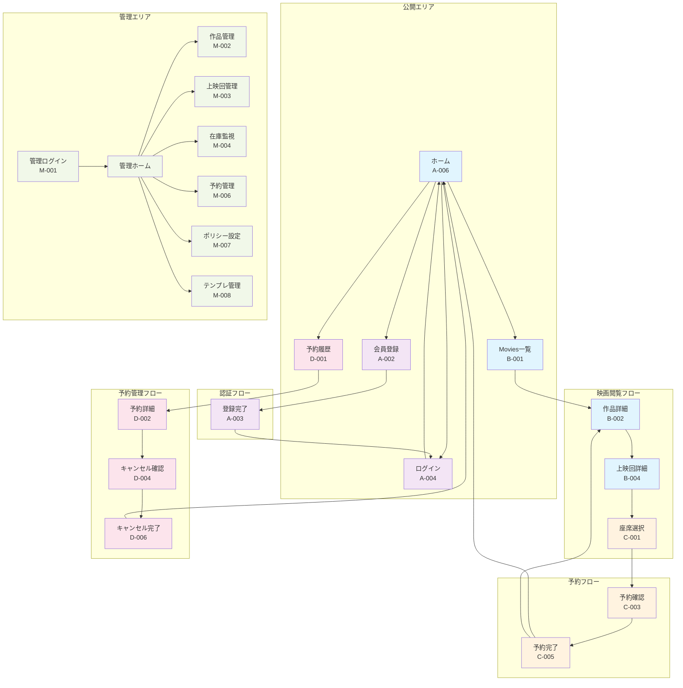
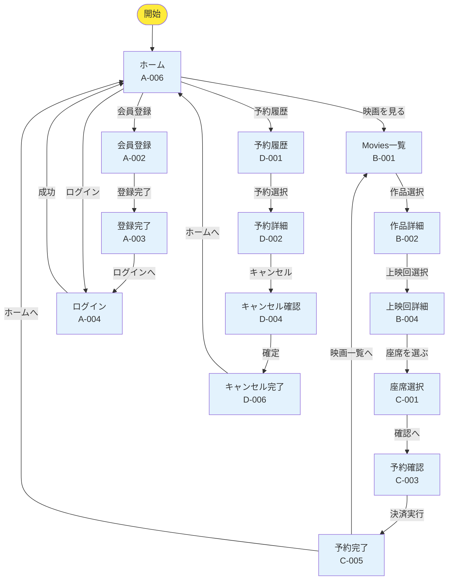
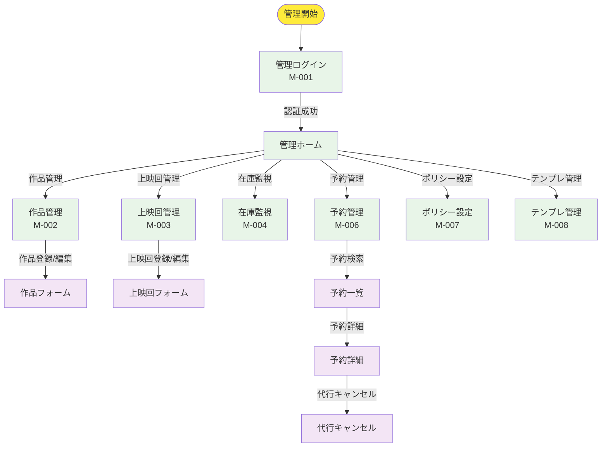
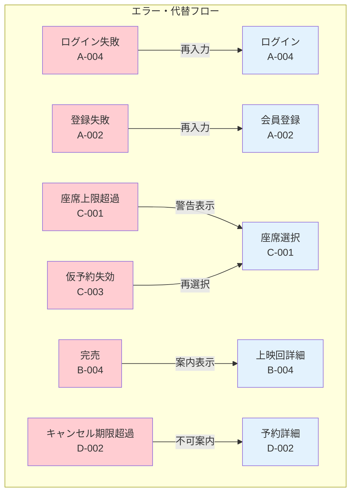

## 画面遷移図（Screen Flow）

本システムの画面遷移を mermaid 形式で整理します。

---

### 全体画面遷移図

---

### 顧客向け詳細フロー

---

### 管理者向け詳細フロー

---

### エラーフロー・代替パス

---

### 画面遷移のルール

- **認証必須画面**: 座席選択以降、予約履歴、管理画面
- **条件分岐**: 完売時は座席選択不可、期限超過時はキャンセル不可
- **タイマー制御**: 仮予約は2分で失効、失効時は再選択へ
- **上限制御**: 座席選択は最大5席まで
- **戻る操作**: 各画面から適切な前画面への戻りリンク
