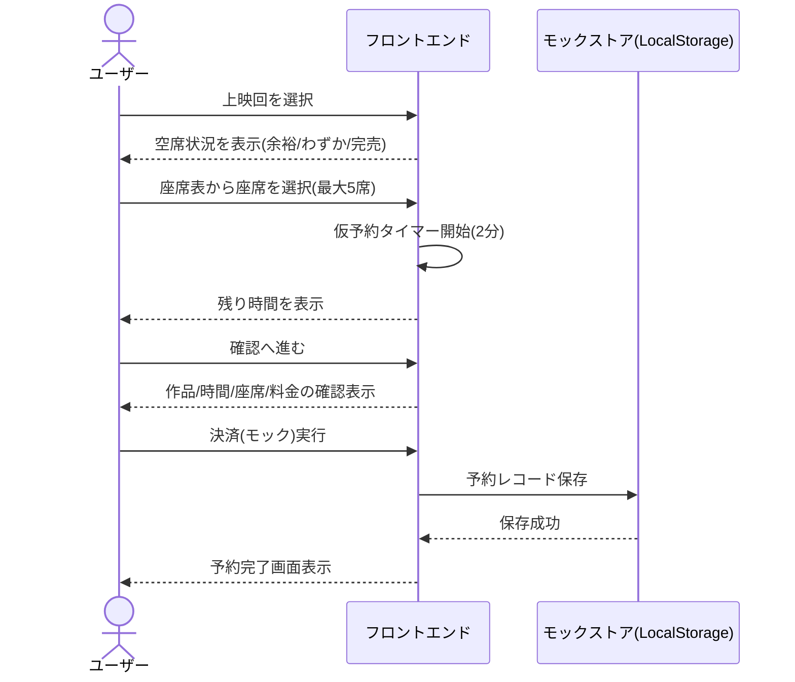
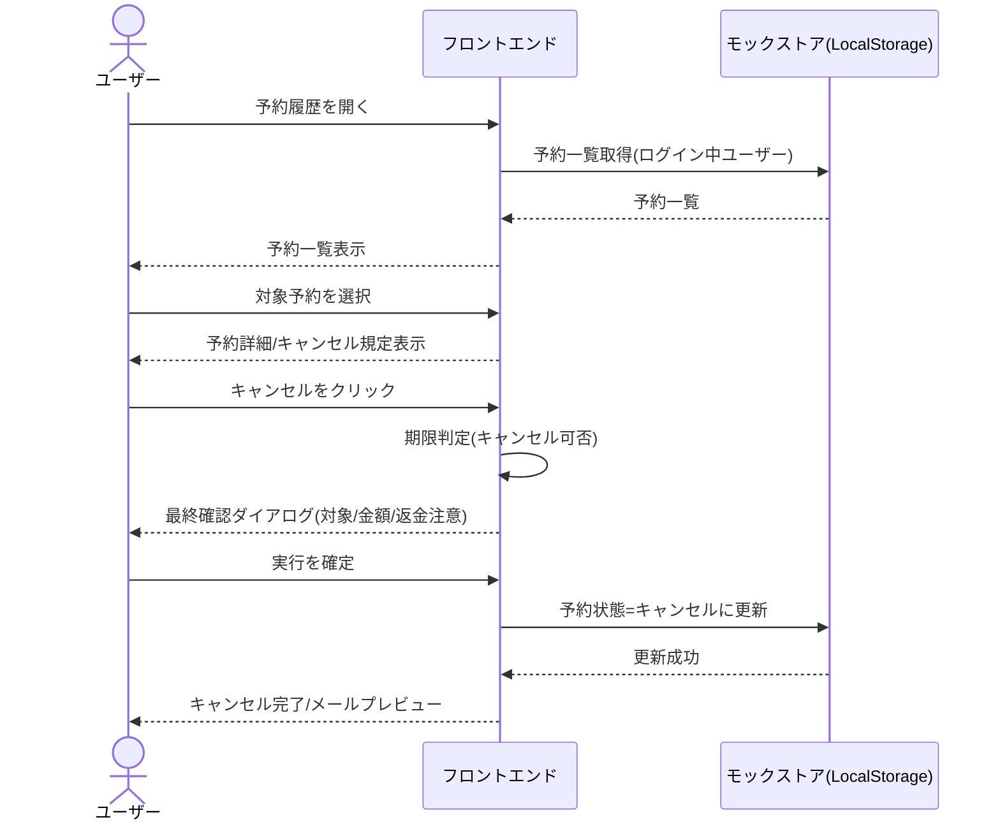
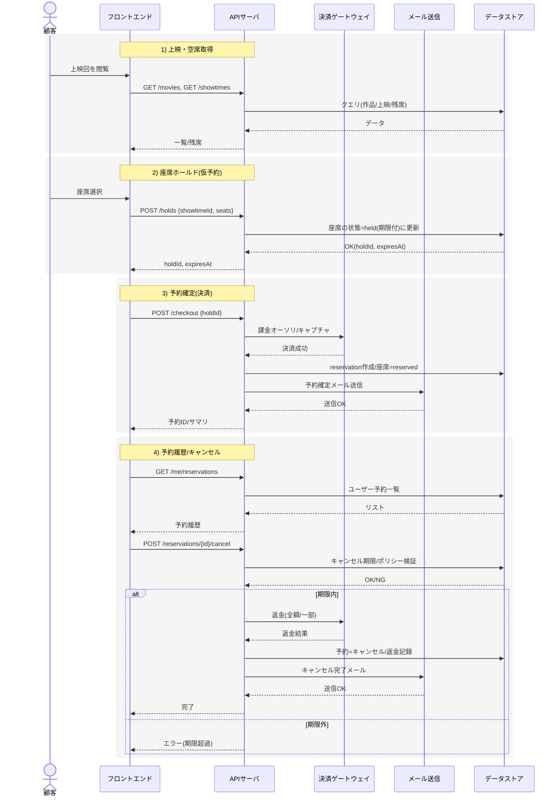
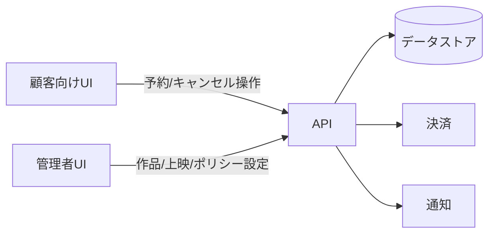
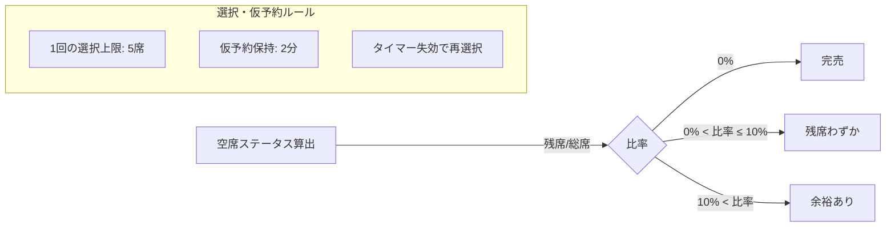

## 業務フロー（Mermaid）

以下は顧客向け主要ユースケースの業務フローです。

```mermaid
flowchart TD
  subgraph A[会員登録・ログイン]
    A1[会員登録フォーム入力\n(メール・パスワード)] --> A2{入力チェック/強度}
    A2 -- OK --> A3[登録完了\n(確認メール案内)]
    A2 -- NG --> A1
    A3 --> A4[ログインフォーム]
    A4 --> A5{認証}
    A5 -- OK --> A6[ログイン状態]
    A5 -- NG --> A4
  end

  subgraph B[上映スケジュール閲覧]
    B1[映画一覧] --> B2[作品詳細]
    B2 --> B3[上映回一覧\n(余裕あり/残席わずか/完売)]
    B3 -->|空席あり| B4[上映回詳細\n(空席状況)]
  end

  subgraph C[座席選択〜予約]
    C1[座席表UI\n(最大5席選択)] --> C2[仮予約開始\n(2分カウントダウン)]
    C2 --> C3[予約内容確認\n(作品/時間/座席/料金)]
    C3 --> C4[決済(モック)\n即時確定]
    C4 --> C5[予約確定\n完了画面]
    C5 --> D1
  end

  subgraph D[予約履歴/キャンセル]
    D1[予約履歴一覧] --> D2[予約詳細]
    D2 --> D3{キャンセル期限内?}
    D3 -- Yes --> D4[注意事項表示\n最終確認]
    D4 --> D5[キャンセル実行\n返金処理(モック)]
    D5 --> D6[キャンセル完了\nメールプレビュー]
    D3 -- No --> D7[期限超過\nキャンセル不可案内]
  end

  A6 --> B1
  B4 --> C1
```

---

### 予約フロー詳細（シーケンス）



---

### キャンセルフロー詳細（シーケンス）



---

## 管理者向けユースケース（Mermaid）

```mermaid
flowchart TD
  subgraph Admin[管理コンソール]
    M1[ログイン(管理者)] --> M2[作品の登録/編集]
    M2 --> M3[上映回の作成/編集\n(スクリーン/時間/価格/座席数)]
    M3 --> M4[座席/予約の状況確認\n(残席・販売数)]
    M4 --> M5[手動調整\n(座席ブロック/開放)]
    M4 --> M6[予約キャンセル代行\n(規定に基づく)]
    M3 --> M7[販売ポリシー設定\n(キャンセル期限/手数料)]
    M7 --> M8[通知テンプレ管理\n(登録/確定/キャンセルメール)]
  end

  classDef kpi fill:#eef,stroke:#99f,color:#333;
  M4:::kpi
```

---

## バックエンド処理（概念モック・Mermaid）



---

### 役割の切り分け



### ステータス/ルール概要（参考）




